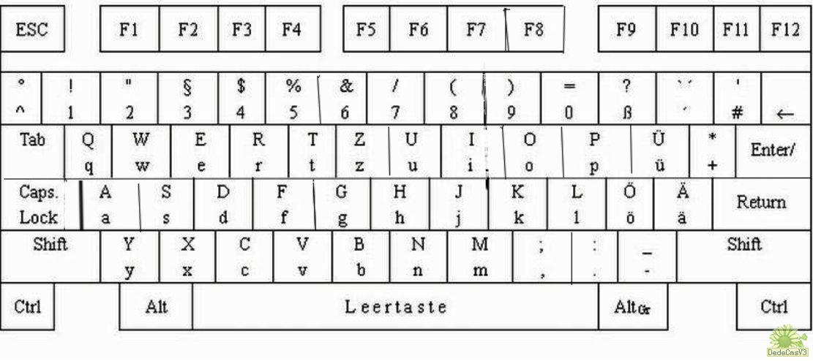

# 功能清单

+ 使用Markdown语法记笔记。
+ 将Markdown文件实时转为html，通过浏览器访问。
+ 支持对所有Markdown文件进行搜索。
+ 启动web服务后，可以在其他地方通过本机ip访问笔记。
+ 出于安全考虑，支持设置允许那些ip访问笔记。

# 一些常见的Markdown语法
这里介绍一些常见的Markdown语法。

## 加粗、倾斜、删除
*字体倾斜（一个\*）*
_字体倾斜（一个\_）_

**字体加粗（两个*）**
__字体加粗（两个_）__

~~删除线（两个~）~~

## 字体大小、颜色
markdown编辑器本身不支持字体、字号、颜色的修改。但因为markdown支持HTML标签，所以可以使用内嵌HTML来实现这些功能。

<font color=#FF000 >红色</font>
<font color=#008000 >绿色</font>
<font color=#FFFF00 >黄色</font>

<font size=2 >2号字</font>
<font size=5 >5号字</font>

### 代码块，文本块
`````
console.log("hello");
`````

`````
文本块
`````

## 图片


## 音频
<audio controls loop src="audio/25_L23_2a_b.mp3"></audio>

## 表格
| 列1   | 列2   | 列3   |
|-------|-------|-------|
| 内容1 | 内容2 | 内容3 |

### 如何插入表格
还没有找到方便插入表格的插件

### 如何格式化表格
vscode安装插件：Markdown Table Formatter

在表格上右击，选择【Format Document with...】，选择Markdown Table Formatter即可格式化。

